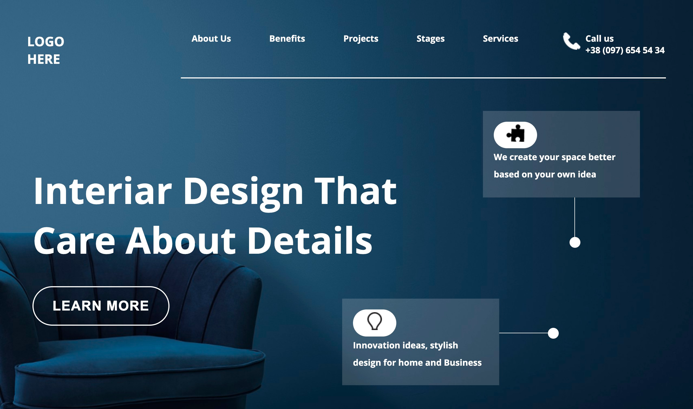

# Interior Design landing page

- This is a Interior Design landing page, made using html and css 

## Screenshot

## Built with

- Semantic HTML5 markup
- CSS custom properties
- Flexbox
- media query

## What I learned
- I learned how to arrange components with flexbox, how to position elements using absolute and usage of media query.

## Time taken
- It took me around 4 hours to built this website from scratch.

## Links
- [live demo](#)
- [source](#)

## Contact me
- GitHub - [@RAM844](https://github.com/RAM844)
- Twitter - [@ShriramBalaji7](https://www.twitter.com/ShriramBalaji7)

